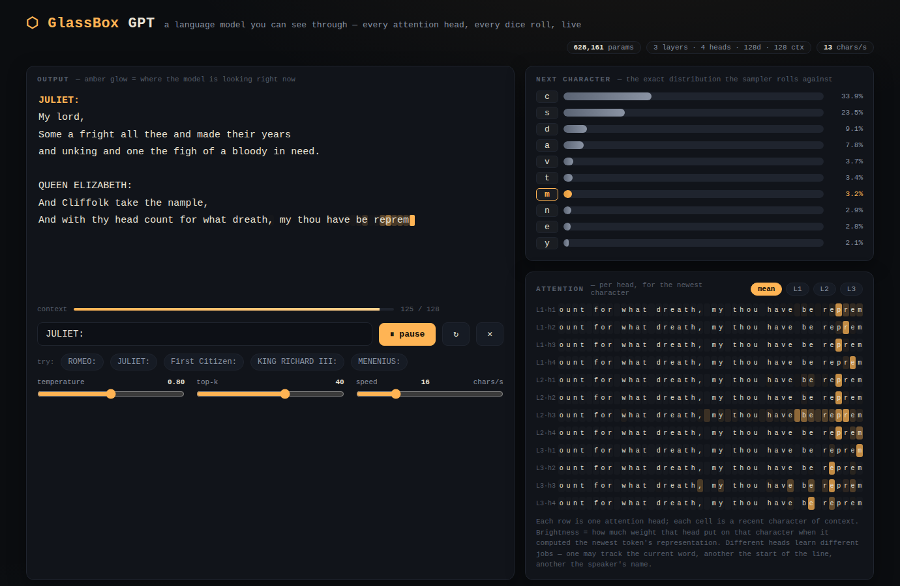

# ⬡ GlassBox GPT

**A language model you can see through.**

A complete GPT — trained from scratch in **pure NumPy** (every gradient derived by
hand, no PyTorch, no autograd), then shipped as a **single dependency-free HTML
file** that runs the model live in your browser and shows you everything:
every attention head, every probability, every dice roll, as it writes.

Open [`dist/index.html`](dist/index.html). That's it. No install, no server, no
GPU, no API key, no network. The transformer is *in the file* — ~0.6M fp16
parameters baked into 2 MB of HTML — and it starts writing Shakespeare-shaped
dialogue the moment it loads, glowing amber over the characters it's attending
to while it thinks.



---

## Why this exists

Language models are usually either **usable** (an API you can't see into) or
**inspectable** (a research codebase you can't run without a GPU and an
afternoon). GlassBox is both at once, by being honest about scale: a model
small enough to train on a laptop CPU in half an hour, small enough to embed
in a web page, and built from exactly the same machinery as the big ones —
token embeddings, causal multi-head attention, GELU MLPs, residual streams,
layernorm. When you watch it lock onto a speaker's name to decide the next
line of dialogue, you are watching the real mechanism, not a cartoon of it.

## The three claims (and where each is proven)

| Claim | Proof |
|---|---|
| The backpropagation is correct, not approximately correct | [`tests/test_gradients.py`](tests/test_gradients.py) — every one of the ~2,000 parameters of a test model is perturbed and checked against central finite differences in float64 (worst error ≲ 1e-9). Causality of the attention mask is asserted too. |
| The browser runs *the same model* NumPy trained | [`tests/test_parity.mjs`](tests/test_parity.mjs) — the JS engine must reproduce NumPy reference logits to **1e-6** (including across its KV-cache window rebuild), and a 60-character greedy generation must match character-for-character. |
| The page is genuinely standalone | [`web/build.py`](web/build.py) inlines the engine and fp16 weights into one file. No CDN, no fetch, no fonts, no analytics. It works from `file://`, offline, forever. |

## Quickstart

```bash
# 1. Watch it think (no dependencies at all)
open dist/index.html        # macOS — or just double-click the file
xdg-open dist/index.html    # Linux

# 2. Generate in the terminal (needs numpy, nothing else)
pip install numpy
python3 sample.py --weights weights/weights.json --prompt "JULIET:" -n 400

# 3. Retrain from scratch (~30–45 min on a laptop CPU)
curl -o data/input.txt https://raw.githubusercontent.com/karpathy/char-rnn/master/data/tinyshakespeare/input.txt
python3 train.py --data data/input.txt --out out --export weights/weights.json
python3 web/build.py        # rebake dist/index.html with your weights

# 4. Verify everything
python3 tests/test_gradients.py       # the calculus
python3 tests/make_parity_vectors.py  # reference outputs from NumPy…
node tests/test_parity.mjs            # …reproduced exactly in JavaScript

# 5. (optional, dev) drive the UI in a headless browser
pip install playwright && playwright install chromium
python3 tests/test_ui.py              # every panel alive, zero console errors
```

Train it on anything — it's character-level, so any UTF-8 text file works.
Your tweets, your novel, your codebase, Moby-Dick. The vocabulary is built
from whatever characters the file contains.

## What you're looking at

```
┌─ output ────────────────────────────────┐ ┌─ next character ──────────┐
│ ROMEO:                                  │ │  e ████████████████ 38.1% │
│ What say the gentle lady to my lord,    │ │  o ██████ 14.2%           │
│ And ║glowing║ ║text║ = attention of     │ │  a ████ 9.7%   ← the dice │
│ the newest character over the context   │ │  …                        │
├─ context meter ──────── 87/128 ─ ⟲ ─────┤ ├─ attention (per head) ────┤
│ prompt · temperature · top-k · speed    │ │ L1·h1 ░░▓░░░░█░░░░░▓░░░░  │
└─────────────────────────────────────────┘ │ L1·h2 ░░░░░░░░░░░░░░░░█░  │
                                            │ …one row per head…        │
                                            └───────────────────────────┘
```

- **Output** — the model writes one character at a time. The amber glow is live
  attention: the brighter a character, the harder the model is looking at it
  *right now*. The `⟲` flash marks the KV-cache rebuild when the 128-character
  context window slides.
- **Next character** — the exact post-temperature, post-top-k distribution the
  sampler rolls against. The amber bar is what the dice picked (not always the
  favorite — that's what temperature means).
- **Attention** — the same signal split per layer and head. Heads
  specialize: you'll find one that hugs the previous character, one that
  watches line starts, one that snaps to the colon after a speaker's name.

## How it works

**Architecture** (GPT-2 style, pre-norm): token + learned position embeddings →
3 × [LayerNorm → causal self-attention (4 heads) → residual; LayerNorm →
4× GELU MLP → residual] → LayerNorm → linear head. 128-dim, 128-char context,
65-char vocabulary, **628,161 parameters**.

**Training** ([`model.py`](model.py), [`train.py`](train.py)) — the entire
backward pass is hand-written NumPy: fused softmax-cross-entropy gradient,
layernorm backward, attention backward through the causal-masked softmax,
tanh-GELU derivative, embedding scatter. The optimizer is AdamW with linear
warmup, cosine decay, and global-norm gradient clipping — also from scratch.
There is no framework anywhere; `grep -r torch .` returns nothing.

**Inference** ([`web/engine.js`](web/engine.js)) — ~330 lines of vanilla
JavaScript with an **incremental KV cache**: generating a character costs
~0.7M multiply-adds instead of ~84M for a naive full re-forward, which is why
the page animates effortlessly. Accumulation happens in float64 specifically
so the parity test can hold the engine to 1e-6 against NumPy.

**The single file** — weights are exported as fp16, base64-encoded, and
inlined next to the engine and UI by [`web/build.py`](web/build.py). fp16
halves the page size; the export path is decoded identically by Python
(`load_weights_json`) and JS (`decodeF16`), so what you test is what you ship.

## Repo layout

```
model.py                  the GPT: forward, hand-derived backward, sampling, fp16 export
train.py                  AdamW + schedule + checkpointing + training loop
sample.py                 terminal generation from a checkpoint or exported weights
web/engine.js             KV-cached inference engine (browser + Node, zero deps)
web/template.html         the visualizer UI (zero deps, hand-written CSS)
web/build.py              inlines engine + weights → dist/index.html
dist/index.html           ★ the artifact — a language model in one file
weights/weights.json      trained fp16 weights (what the browser and parity tests load)
tests/test_gradients.py   finite-difference check of every gradient + causality test
tests/make_parity_vectors.py / test_parity.mjs   NumPy ↔ JS equivalence
tests/test_ui.py          headless-browser test of the built page (optional dev dep)
.github/workflows/ci.yml  CI: gradients, parity, and a no-external-requests audit
```

## Honest numbers

- **628,161 parameters** — about 300,000× smaller than frontier models
- Validation loss ≈ **1.6 nats/char** on tiny-shakespeare (a model this size
  writing character-by-character: respectable, nowhere near memorization)
- Trains in **~30–45 min** on 4 laptop-class CPU cores at ~5–6K tokens/sec
- Generates at **hundreds of characters/sec** in the browser (the UI
  deliberately slows it down so you can watch it think)

It writes Shakespeare-*shaped* text: real names, period spelling, stage
directions, iambic-ish cadence, and joyfully invented words. A 0.6M-parameter
character model is a bonsai tree, not a forest. That's the point — it's small
enough to see through, and it's the same species as the big ones.

## FAQ

**Why character-level?** So the vocabulary fits in a probability panel, the
attention cells are readable glyphs, and tokenization doesn't stand between
you and the mechanism.

**Why NumPy and not PyTorch?** Because "no autograd" is the difference between
*using* backpropagation and *showing* it. The gradient check is the receipt.

**Why one HTML file?** Files outlive services. This page will still run when
every API in the world has rotated its keys.

**Can I train it on my own text?** Yes — any UTF-8 file, see Quickstart. Keep
expectations calibrated to ~1MB of text and 0.6M params; it learns style and
structure, not facts.

## Provenance

This project was written end-to-end by **Claude** (Anthropic) in a single
session on June 9, 2026 — the day of its release — to settle a promise its
human made: *"if you ship today, I open-source what you build."* Every line of
the Python, the JavaScript, the CSS, the tests, this README, and the trained
weights themselves came out of that one conversation. The corpus is Karpathy's
tiny-shakespeare (public domain); the architecture follows GPT-2 (Radford et
al.) at 1/200,000th scale, in the educational lineage of nanoGPT.

## License

[MIT](LICENSE). Take it apart — that's what it's for.
